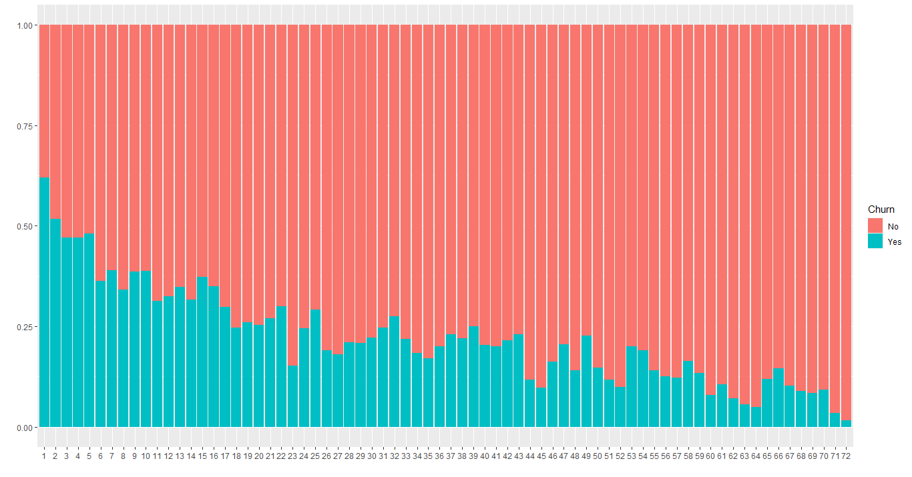
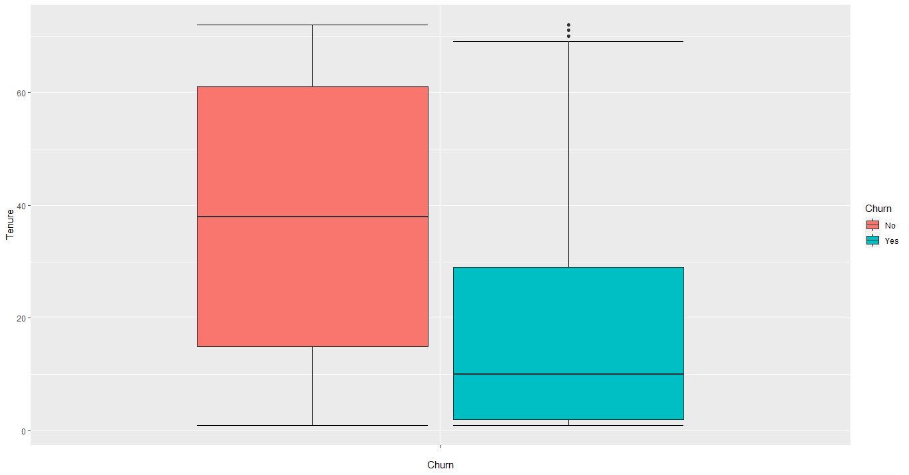
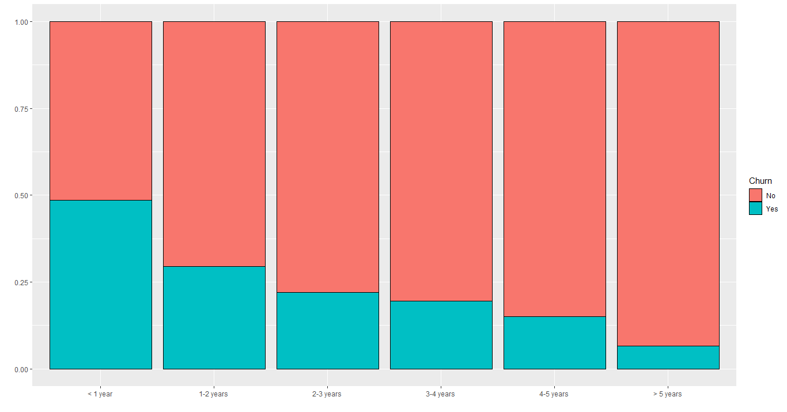
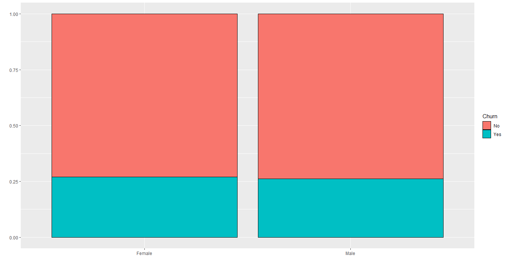
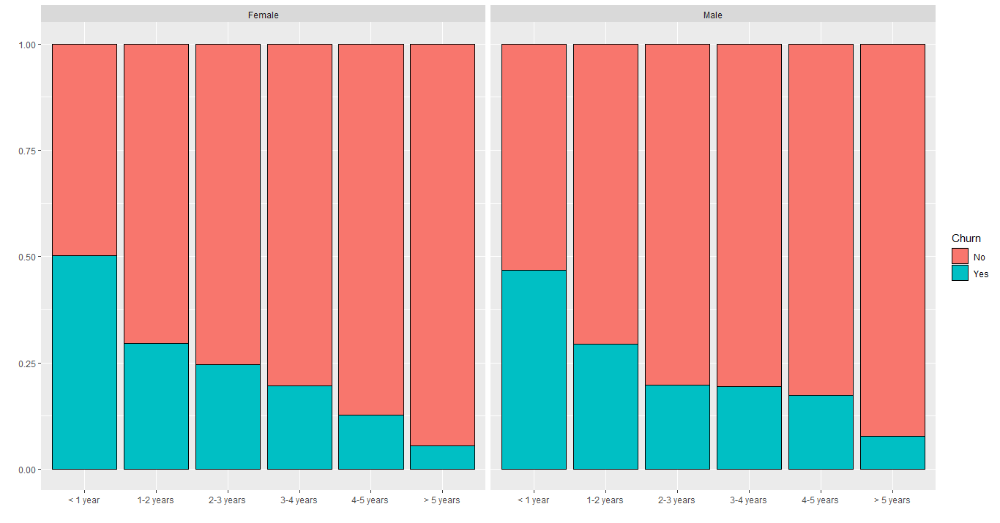

# Customer Churn Analytics  <!-- omit in toc -->
## Project Overview  <!-- omit in toc -->
The goal of this project is to understand why people are leaving (or have left) the company, and how to predict that behavior for other customers. Churn Analytics is very important, because when you understand the people's behavior that leave your company, you can improve your service (or product) specifically to retain those customers, maximizing profit.  
The dataset used is the [`Telco-Customer-Churn.csv`](Telco-Customer-Churn.csv), from a telecommunications company that contains data of more than 7000 customers.  
Three models were used in the predictive modeling: Logistic Regression, Decision Tree and Random Forest. The resulting accuracies are in the following table:

| Model | Accuracy |
| ----- | -------- |
| Logistic Regression | 78.94% |
| Decision Tree | 77.75% |
| Random Forest | 78.04% |

## Table of Contents  <!-- omit in toc -->
- [Understanding the Data](#understanding-the-data)
- [Data Cleaning](#data-cleaning)
- [Exploratory Data Analysis](#exploratory-data-analysis)
  - [**Tenure Analysis**](#tenure-analysis)
  - [**Personal Analysis**](#personal-analysis)
    - [**Gender**](#gender)

## Understanding the Data
The dataset has 7043 rows and 23 columns. The column's description and their values are represented in the following table:

| Column | Variable Type | Description | Values |
| -----  | :-------------: | ----------- | :------: |
| CustomerId | Categorical/Nominal | Unique identification of each customer | 9999-XXXXX |
| gender | Categorical/Binary | the customer's gender | Male, Female |
| SeniorCitizen | Categorical/Binary | whether the customer is Senior or not | 0, 1 |
| Partner | Categorical/Binary | whether the customer has a partner or not | Yes, No |
| Dependents | Categorical/Binary | whether the customer has dependents or not | Yes, No |
| tenure | Quantitative/Discrete | the number of months the customer has in the company | 0 to 72 |
| PhoneService | Categorical/Binary | whether the customer has phone service or not | Yes, No |
| MultipleLines | Categorical/Nominal | whether the customer has multiple lines or not | Yes, No, No Phone Service |
| InternetService | Categorical/Nominal | the type of internet the customer has | DSL, Fiber optic, No |
| OnlineSecurity, OnlineBackup, DeviceProtection, TechSupport, StreamingTV, StreamingMovies | Categorical/Nominal | whether the customer has each service or not | Yes, No, No Internet Service |
| Contract | Categorical/Nominal | the type of contract | month-to-month, One year, Two year |
| PaperlessBilling | Categorical/Binary | whether the customer has paperless billing or not | Yes, No |
| PaymentMethod | Categorical/Nominal | the method of payment | Electronic check, Mailed check, Bank transfer (automatic), Credit card (automatic) |
| MonthlyCharges | Quantitative/Continuous | the monthly charges in dollars | 18.25 to 118.75 |
| TotalCharges | Quantitative/Continuous | the total charges since the customer entered in the company (in dollars) | 18.8 to 8684.8 |
| Churn | Binary | whether the customer left the company or not | Yes, No |

## Data Cleaning
- The dataset contains 11 NA values in the column **TotalCharges**. Considering that this is equivalent to *0.15%* of the total, these rows were removed, leaving 7032 remaining. *Obs: all 11 values ​​are from customers who are in the company for 0 months (new customers). We could keep those rows, but just 11 values won't be a problem, so we can delete them.*  
- The column **CustomerId** is only an identifier, so it can be excluded.
- All binary categorical variables are between *Yes/No*, so the **SeniorCitizen** was changed from *1/0* to *Yes/No* to keep the pattern.

## Exploratory Data Analysis

### **Tenure Analysis**
Before diving in each column, let's analyze the **tenure** column, that has quantitative values in it. The following image shows the proportion between the customer left the company or not for each value of tenure:

Clearly, the longer the customer's time in the company, the lower the churn rate (left the company). But what we can see from this image is that the difference from one month to the next is small (although the trend is very clear), so this column could be converted into a categorical variable separated by years in the company.  
Another analysis that we can do on the **tenure** column is to show the range of people who left and stayed in the company. The next image shows that in a boxplot:

The boxplot shows us that 50% of customers left the company before or equal to 10 months (look the median on the blue box). The rest of them are distributed between 10 and 72, which is way more sparse. So, this is definitely a good problem to focus on.  
As we saw before, maybe it's better to convert the **tenure** column into categorical variables. So, it'll be divided into 6 categories, which are:

| Category | Values |
| -------- | ------ |
| <1 year | 1 to 11 |
| 1-2 years | 12 to 23 |
| 2-3 years | 24 to 35 |
| 3-4 years | 36 to 47 |
| 4-5 years | 48 to 59 |
| >5 years | 60 to 72 |

Now, let's analyze those categories instead discrete values:

We still can see the negative trend across the categories, but it is now clearer where the problem lies. It is evident that the first year of service has the highest churn rate (almost 50%).

### **Personal Analysis**
This section will focus on those columns related to customer's information, which are: **gender**, **SeniorCitizen**, **Partner** and **Dependents**.  
#### **Gender**
The column **gender** has 2 possible values: *Male* or *Female*. The image below shows the churn rate for each gender:

Apparently, there are no differences between the customer's gender. Let's analyze gender's churn rate grouped by tenure:

There are very few differences between them, concluding that **gender** is not a significant factor to determine if the customer will leave or not the company.

