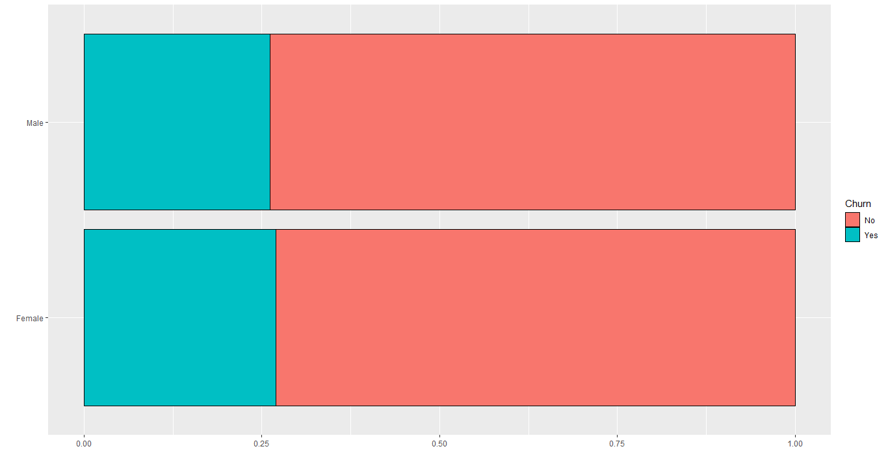

# Customer Churn Analytics  <!-- omit in toc -->
## Project Overview  <!-- omit in toc -->
The goal of this project is to understand why people are leaving (or have left) the company, and how to predict that behavior for other customers. Churn Analytics is very important, because when you understand the people's behavior that leave your company, you can improve your service (or product) specifically to retain those customers, maximizing profit.  
The dataset used is the [`Telco-Customer-Churn.csv`](Telco-Customer-Churn.csv), from a telecommunications company that contains data of more than 7000 customers.  
Three models were used in the predictive modeling: Logistic Regression, Decision Tree and Random Forest. The resulting metrics are in the following table:

| Model | Accuracy | Precision | Recall | F1 Score |
| :---: | :------: | :-------: | :----: | :------: |
| Logistic Regression | 76.71% | 54.38% | 76.43% | 63.55% |
| Decision Tree | 76.14% | 53.91% | 70.18% | 60.98% |
| Random Forest | 77.23% | 55.63% | 70.54% | 62.2% |

## Table of Contents  <!-- omit in toc -->
- [Understanding the Data](#understanding-the-data)
- [Data Cleaning](#data-cleaning)
- [Exploratory Data Analysis (EDA)](#exploratory-data-analysis-eda)
  - [Tenure Analysis](#tenure-analysis)
  - [Personal Analysis](#personal-analysis)
    - [Gender](#gender)
    - [Senior Citizen](#senior-citizen)
    - [Partner](#partner)
    - [Dependents](#dependents)
  - [Phone Services Analysis](#phone-services-analysis)
    - [Phone Service and Multiple Lines](#phone-service-and-multiple-lines)
  - [Internet Services](#internet-services)
    - [Online Security to Streaming Movies](#online-security-to-streaming-movies)
  - [Payment Analysis](#payment-analysis)
    - [Contract](#contract)
    - [Paperless Billing](#paperless-billing)
    - [Payment Method](#payment-method)
  - [Charges Analysis](#charges-analysis)
  - [Chi-Squared Test](#chi-squared-test)
- [Predictive Modeling](#predictive-modeling)
  - [Evaluation Metrics](#evaluation-metrics)
  - [Logistic Regression](#logistic-regression)
  - [Decision Tree](#decision-tree)
  - [Random Forest](#random-forest)
  - [Summary](#summary)
- [Conclusion](#conclusion)

## Understanding the Data
The dataset has 7043 rows and 23 columns. The column's description and their values are represented in the following table:

| Column | Variable Type | Description | Values |
| -----  | :-------------: | ----------- | :------: |
| CustomerId | Categorical/Nominal | Unique identification of each customer | 9999-XXXXX |
| gender | Categorical/Binary | the customer's gender | Male, Female |
| SeniorCitizen | Categorical/Binary | whether the customer is Senior or not | 0, 1 |
| Partner | Categorical/Binary | whether the customer has a partner or not | Yes, No |
| Dependents | Categorical/Binary | whether the customer has dependents or not | Yes, No |
| tenure | Quantitative/Discrete | the number of months the customer has in the company | 0 to 72 |
| PhoneService | Categorical/Binary | whether the customer has phone service or not | Yes, No |
| MultipleLines | Categorical/Nominal | whether the customer has multiple lines or not | Yes, No, No Phone Service |
| InternetService | Categorical/Nominal | the type of internet the customer has | DSL, Fiber optic, No |
| OnlineSecurity, OnlineBackup, DeviceProtection, TechSupport, StreamingTV, StreamingMovies | Categorical/Nominal | whether the customer has each service or not | Yes, No, No Internet Service |
| Contract | Categorical/Nominal | the type of contract | month-to-month, One year, Two year |
| PaperlessBilling | Categorical/Binary | whether the customer has paperless billing or not | Yes, No |
| PaymentMethod | Categorical/Nominal | the method of payment | Electronic check, Mailed check, Bank transfer (automatic), Credit card (automatic) |
| MonthlyCharges | Quantitative/Continuous | the monthly charges in dollars | 18.25 to 118.75 |
| TotalCharges | Quantitative/Continuous | the total charges since the customer entered in the company (in dollars) | 18.8 to 8684.8 |
| Churn | Binary | whether the customer left the company or not | Yes, No |

## Data Cleaning
- The dataset contains 11 NA values in the column **TotalCharges**. Considering that this is equivalent to *0.15%* of the total, these rows were removed, leaving 7032 remaining. *Obs: all 11 values ​​are from customers who are in the company for 0 months (new customers). We could keep those rows, but just 11 values won't be a problem, so we can delete them.*  
- The column **CustomerId** is only an identifier, so it can be excluded.
- All binary categorical variables are between *Yes/No*, so the **SeniorCitizen** was changed from *1/0* to *Yes/No* to keep the pattern.

## Exploratory Data Analysis (EDA)

### Tenure Analysis
Before diving in each column, let's analyze the **tenure** column, that has quantitative values in it. The following image shows the proportion between the customer left the company or not for each value of tenure:

Clearly, the longer the customer's time in the company, the lower the churn rate (left the company). But what we can see from this image is that the difference from one month to the next is small (although the trend is very clear), so this column could be converted into a categorical variable separated by years in the company.  
Another analysis that we can do on the **tenure** column is to show the range of people who left and stayed in the company. The next image shows that in a boxplot:

The boxplot shows us that 50% of customers left the company before or equal to 10 months (look the median on the blue box). The rest of them are distributed between 10 and 72, which is way more sparse. So, this is definitely a good problem to focus on.  
As we saw before, maybe it's better to convert the **tenure** column into categorical variables. So, it'll be divided into 6 categories, which are:

| Category | Values |
| -------- | ------ |
| <1 year | 1 to 11 |
| 1-2 years | 12 to 23 |
| 2-3 years | 24 to 35 |
| 3-4 years | 36 to 47 |
| 4-5 years | 48 to 59 |
| >5 years | 60 to 72 |

Now, let's analyze those categories instead discrete values:

We still can see the negative trend across the categories, but it is now clearer where the problem lies. It is evident that the first year of service has the highest churn rate (almost 50%).

### Personal Analysis
This section will focus on those columns related to customer's information, which are: **gender**, **SeniorCitizen**, **Partner** and **Dependents**.

#### Gender
The column **gender** has 2 possible values: *Male* or *Female*. The image below shows the churn rate for each gender:  
  
Apparently, there are no differences between the customer's gender. Let's analyze gender's churn rate grouped by tenure:  
  
There are very few differences between them, concluding that **gender** is not a significant factor to determine if the customer will leave or not the company.

#### Senior Citizen
The churn rate if the customer is Senior or not is represented in the image below:  
  
Seeing that, we can see the difference between them, which indicates that this column could be useful to predict if the customer will leave or not. But this alone doesn't tell us too much, we need to analyze related to tenure too.  
  
According to this image, the churn rate of senior customers in the first year is above 62%, followed by more than 50% in the second year, which is really bad. The company definitely should investigate this issue.

#### Partner
Let's take a look in the **Partner** distribution:  
  
We can see a difference there, saying that customers that don't have a partner tends to leave more than those who do. But we can't conclude that just because of this plot. Let's see that column grouped by tenure:  
  
Apparently, both situations are equally distributed across tenure, what indicates differences in quantity. Maybe there are more customers that don't have a partner within first year of service. Plotting this:  
  
Looking at this plot, we can see that in the first year, there are more customers without a partner, as we suspected. Therefore, this can add bias to our model in the predictive modeling because nothing but distribution indicates that having a partner or not affects the churn rate. Instead, this only supports the importance of **tenure** to churn.  
*Obs: pay attention to the legend. The last plot is filled by Partner, not Churn.*

#### Dependents
The distribution in the **Dependents** column is:  
  
Again, customers that don't have dependents tend to leave more often. But this can be a difference in quantity again. Let's check it:  
  
The same thing that happened with **Partner**'s column, happens here: the 2 classes aren't well distributed throughout the tenure. The problem is that we know that **tenure** is significant to determine if the customer churn or not, so based on this difference in quantity on those 2 columns, this can lead to a error, when the model gives to much weight to these columns, when is the tenure that is affecting the churn.  
In the predictive modeling step, we should keep an eye to these columns (**Partner** and **Dependents**) to see if we can improve accuracy deleting them.

### Phone Services Analysis
This section is about the columns **PhoneService** and **MultipleLines**.

#### Phone Service and Multiple Lines
The following table shows the distribution of the **PhoneServices** column:

| Have Phone Service? | Quantity | Percent |
| :-------------------: | :--------: | :-------: |
| Yes | 6352 | 90.33% |
| No | 680 | 9.67% |

This column is highly unbalanced, but the churn rate for each value is basically equal, as we can see in the image below:  
  
Let's check the **MultipleLines** distribution:  
  
Basically, the same thing happened here, having or not these services don't affect that much in the churn rate. Again, those are 2 columns that could be excluded later.

### Internet Services
This section will analyze every Internet Services in the dataset, from **OnlineSecurity** to **StreamingMovies**. Starting with the presence or not of Internet Service, we have this distribution:  
  
Clearly, we can see that the *fiber optic* service has a problem, given the highest churn rate in all categories. If that behavior had happened only in the first year, probably would be a quantity issue again. But it repeats all over tenure categories, therefore having fiber optic definitely impacts on the churn outcome.  
Also, customers that don't have any internet services have the lowest churn rate. Now we need to verify that churn rate across all services related to internet.

#### Online Security to Streaming Movies
The following plot shows the distribution of all these services:  
  
Again, we can see that customers that don't have internet service have the lowest churn rate, in contrast to those that have internet but don't have separated services. But we can't take conclusion yet, because this can be a higher quantity of customers within the first year that don't have these services yet. Let's check for it:  
  
Indeed, all services have more customers within the first year, but that alone doesn't explain why customers that haven't these services tends to leave the company. The churn rate for this category (customers that don't have these services) is above 50% for every service. Apparently, customers that have these services or don't have internet at all tends to stay in the company. That could be a solution to this problem: the company could offer these services for a lower price for those customers, trying to retain them.  
And for the fiber optic service, definitely the company should investigate that to improve it or fix any problems.

### Payment Analysis
This section will focus on payment methods and bill related variables, from **Contract** to **PaymentMethod**.

#### Contract
There are 3 options of contracts: *month-to-month*, *one year* and *two year*. Let's see how it is distributed:
  
According to this plot, we can see that more the customer is in the company, he tends to sign *two year* contracts, and the churn rate are much lower. Also, a high quantity of customers in the first year tends to sign the monthly contract, what makes sense.  
But this column looks more like a consequence than a cause to the churn problem. The dataset contains more newer customers and newer clients tends to leave more often, so the kind of contract it's just a consequence. One thing that supports that, it is the fast decrease on churn rate in the second year. But, just for precaution, it's not bad to investigate these customers and their services.

#### Paperless Billing
There are a option to have paperless billing or not, plotting this distribution grouped by tenure:  
  
According to this image, every tenure category has the same behavior: customers that have paperless billing tends to leave more often than those who haven't. So, definitely this is a variable we want to keep.

#### Payment Method
There are 4 kinds of payment methods: *Bank transfer (automatic)*, *Credit card (automatic)*, *Electronic check* and *Mailed check*. They are evenly distributed, except for *electronic check* which has a little more customers. The image below shows the distribution filled by **Churn**:  
  
Where *BT* are *Bank transfer*, *CC* is *Credit Card*, *EC* is *Electronic Check* and *MC* is *Mailed Check*. It is visible that customers that have *electronic check* as their payment method, also have the highest churn rate in every tenure category, which should be a significant factor to predict the **Churn**. The other methods are very similar, except for *Mailed Check* that has the lowest churn rate. 

### Charges Analysis
This section will focus on the 2 numerical columns: **MonthlyCharges** and **TotalCharges**. The scatter plot below shows the relationship between the monthly charges and total charges:  
  
We can see different 'columns' on that scatterplot showing some different service plans. Also, we can see a linear relationship between the variables, that is, when monthly charges increases, total charges also increases in a linear manner, the same occurs with time: increasing tenure time, also increases the total charges.  
Therefore, if these 2 variables are related to each other, that makes no sense to keep them together. **MonthlyCharges** apparently represents better the customer's behavior, so **TotalCharges** will be deleted. The image below shows the distribution of monthly charges:  
  
This histogram shows interesting behaviors. It's visible that the churn rate is high in every facet when the charges 'moves' to the right (becomes more expensive). In the first year, this range is between 60 and 90, becoming between 90 and 110 after 5 years in the company. Maybe this is related to additional services, that we saw that could be causing this churn. Anyway, this is an specific range and should be investigated for sure.

### Chi-Squared Test
Before building the models to predict the Churn, let's see the correlations between variables and the outcome using the chi-squared test. Basically, if the p-value is lower than 0.05, it means the variables are dependent (the other one being the churn). The following table shows all p-values:

| Column | p-value |
| ------ | ------- |
| gender | **4.904885e-01** | 
| SeniorCitizen | 2.479256e-36 |
| Partner | 3.973798e-36 |
| Dependents | 2.019659e-42 |
| tenure | 4.119229e-192 |
| PhoneService | **3.499240e-01** |
| MultipleLines | **3.567927e-03** |
| InternetService | 5.831199e-159 |
| OnlineSecurity | 1.400687e-184 |
| OnlineBackup | 7.776099e-131 |
| DeviceProtection | 1.959389e-121 |
| TechSupport | 7.407808e-180 |
| StreamingTV | 1.324641e-81 |
| StreamingMovies | 5.353560e-82 |
| Contract | 7.326182e-257 |
| PaperlessBilling | 8.236203e-58 |
| PaymentMethod | 1.426310e-139 |

The bold values are the ones closer to the significance level (0.05). As we can see, the **gender**, **PhoneService** and **MultipleLines** are barely significant to the Churn. And other columns like **Partner** and **Dependents** that probably it's a tenure problem, shows a low p-value, which means they are relevant to Churn (looking purely to this test).

## Predictive Modeling
Before diving in the models, we need to prepare the dataset. There are 3 things to do:
- Delete **TotalCharges** column;
- Convert *character* columns to *factor*;
- Change **Churn** values from *No* to 0 and *Yes* to 1;
- Split the dataset into *training* and *test* sets (70/30 split).

After that, we'll take 2 paths: the first one is to use only the relevant columns according to the chi-squared test. The second path we'll use only relevant columns based on our previous analysis and compare the results.

There will be used 3 different models: *Logistic Regression*, *Decision Tree* and *Random Forest*.

### Evaluation Metrics
To decide which evaluation metric we'll use, we need to understand the problem first. The company want to retain as many customers they can, increasing profit and customer's satisfaction, so we need to predict correctly customers that would leave, that way we can retain them. Basically we have 3 evaluation metrics that we can use: **Accuracy**, **Precision** and **Recall**.  
- Accuracy in this context means that we are getting the predictions right, both for customers that would churn or not. Therefore, higher the accuracy, better for us.  
- Precision means of all positive predictions, how many we got it right. A high precision in this case, could be converted in more satisfied customers, so we want to keep that high.
- Recall is about the actual customers that would leave. How many of them we predicted right, and how many we predicted that them wouldn't leave. So, definitely we need to keep recall high enough, because we don't want to predict positive customers as negatives.  
And finally, there is the **F1 Score**, which is a combination of **Precision** and **Recall**, so instead of maximizing two separate scores, we can try to maximize only one depending on the case.  

### Logistic Regression
For the first attempt, the columns **gender**, **PhoneService** and **MultipleLines** were excluded. Using a threshold of 0.5, the result was:

| Accuracy | Precision | Recall | F1 Score |
| :------: | :-------: | :----: | :------: |
| 80.88% | 68.82% | 51.25% | 58.75% |

The dataset is highly unbalanced in respect to Churn, that way the model tends to classify the new observations as the majority class (in this case, churn as 'No'). Moving the threshold to 0.3, we got:

| Accuracy | Precision | Recall | F1 Score |
| :------: | :-------: | :----: | :------: |
| 76.71% | 54.38% | 76.43% | 63.55% |

The accuracy is still good, but the precision now is near 50%, which means that of all our positive predictions we hit it only half of them. In contrast the Recall was 76%, which is relatively good, because of all *positive* customers, we hit it almost 80% of them. There are 560 customers with positive Churn on the test set and this last model got it right for 428 of them. Maybe the company would low the charges, add some bonus services, directed marketing campaigns for these predicted customers, that way this low precision shouldn't hurt the company at all.

### Decision Tree
Using the Decision Tree algorithm, we got the following results, both for a threshold of 0.5 and 0.3:

| Threshold | Accuracy | Precision | Recall | F1 Score |
| :-------: | :------: | :-------: | :----: | :------: |
| 0.5 | 78.94% | 64.08% | 47.14% | 54.32% |
| 0.3 | 76.14% | 53.91% | 70.18% | 60.98% |

Again, using a lower threshold gave us better results, considering that we want to maximize the *Recall*, as well as *F1 Score*. Only changing the threshold we increased the *Recall* by 23%, not affecting that much the *Precision* (near 10%) and also improving the *F1 Score* by 6%, which is good.

### Random Forest
The Random Forest algorithm gave us the following results:

| Threshold | Accuracy | Precision | Recall | F1 Score |
| :-------: | :------: | :-------: | :----: | :------: |
| 0.5 | 79.41% | 65.22% | 48.21% | 55.44% |
| 0.3 | 77.23% | 55.63% | 70.54% | 62.2% |

### Summary
All the models performed better using a 0.3 threshold, as we're using the *Recall* and *F1 Score* as the main metrics. A summary showing the results of all 3 models are represented in the following table:

| Model | Accuracy | Precision | Recall | F1 Score |
| :---: | :------: | :-------: | :----: | :------: |
| Logistic Regression | 76.71% | 54.38% | 76.43% | 63.55% |
| Decision Tree | 76.14% | 53.91% | 70.18% | 60.98% |
| Random Forest | 77.23% | 55.63% | 70.54% | 62.2% |

The three models got similar results, for every metric we used. But the *Logistic Regression* algorithm performed slightly better, as the *Recall* got higher than others, as well as the *F1 Score*. 

## Conclusion
The *Logistics Regression* algorithm performed better than others, therefore should be used in this case. For a company that never have did *Churn Analytics*, a model that predict with a *Recall* above 75% is quite good. From 100 customers that would leave the company, imagine that the company retained 75 of them, this is extremely relevant for the company, as well for its profits.  
Every company should be doing Data Science, *Churn Analytics* it's only a piece from an universe of possibilites to help the company and theirs customers, and this project showed exactly that.  
